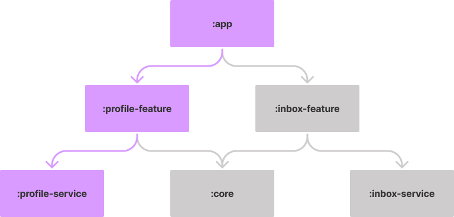

# Change Tracker Plugin

A Gradle plugin to help analyse the dependency between modules and run tasks only on modules impacted by specific set of changes.

The idea behind this plugin is to optimize running verification tasks on large modularized projects. There is no need to run these tasks on all modules every time we apply a change. Instead, we could run them only on modules affected by the changes and their dependents.

___

Take the following project structure as an example:

<br>
<p align="center">

</p>
<br>

If you apply changes to the `:profile-service` module, you only need to run your verification tasks on `:profile-service`, `:profile-feature`, and `:app`. It's safe to skip the tasks on all the other modules since they don't depend on `:profile-service` and can't be affected by these changes.

## Setup

Apply the plugin and the configuration to your root project `build.gradle`

```groovy 
plugins {
    id 'com.ismaeldivita.changetracker' version '0.7.4'
}

// ...

changeTracker {
    tasks = ['lint','testDebugUnitTest']
    whitelist = [':app']
    blacklist = [':network',':featureA']
    reevaluate = [':sharedTest']
    branch = "master"
    remote = "origin"
}
```

- `tasks`: List of the tasks the plugin will need to create.
- `branch`: Name of the branch that should be used to extract the diff.
- `whitelist` (optional): List of modules that should **always** run.
- `blacklist` (optional): List of modules that should **never** run.
- `reevaluate` (optional): List of modules that will trigger the task for all modules
- `remote` (optional): Name of the remote repository.

## Usage

The plugin will generate new tasks on the root project for each task provided on the configuration with the following name `${taskName}ChangedModules`.

Taking as an example the configuration above the plugin will generate two new tasks `lintChangedModules` and `testDebugUnitTestChangedModules`.

To run your task:

```
./gradlew testDebugUnitTestChangedModules
```

You can override the default branch used for the comparison when running your command. This is useful when you're using the plugin on pull requests and each pull request may have different base branches.
```
./gradlew testDebugUnitTestChangedModules -Pbranch=dev
```

## Notes
- This plugin will assume you use GIT as your VCS.
- Any changes to the root project or `buildSrc` will trigger the task for all modules.
- Test configurations will not be tracked since dependency cycles could be created for test purposes and this is not supported by this plugin. If you have a shared test library project and want to trigger the tasks on their dependents check the `reevaluate` configuration.

## License
MIT License

Copyright (c) 2019 Ismael Di Vita

Permission is hereby granted, free of charge, to any person obtaining a copy
of this software and associated documentation files (the "Software"), to deal
in the Software without restriction, including without limitation the rights
to use, copy, modify, merge, publish, distribute, sublicense, and/or sell
copies of the Software, and to permit persons to whom the Software is
furnished to do so, subject to the following conditions:

The above copyright notice and this permission notice shall be included in all
copies or substantial portions of the Software.

THE SOFTWARE IS PROVIDED "AS IS", WITHOUT WARRANTY OF ANY KIND, EXPRESS OR
IMPLIED, INCLUDING BUT NOT LIMITED TO THE WARRANTIES OF MERCHANTABILITY,
FITNESS FOR A PARTICULAR PURPOSE AND NONINFRINGEMENT. IN NO EVENT SHALL THE
AUTHORS OR COPYRIGHT HOLDERS BE LIABLE FOR ANY CLAIM, DAMAGES OR OTHER
LIABILITY, WHETHER IN AN ACTION OF CONTRACT, TORT OR OTHERWISE, ARISING FROM,
OUT OF OR IN CONNECTION WITH THE SOFTWARE OR THE USE OR OTHER DEALINGS IN THE
SOFTWARE.
