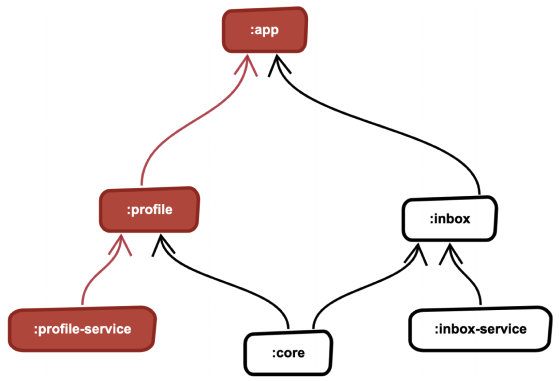
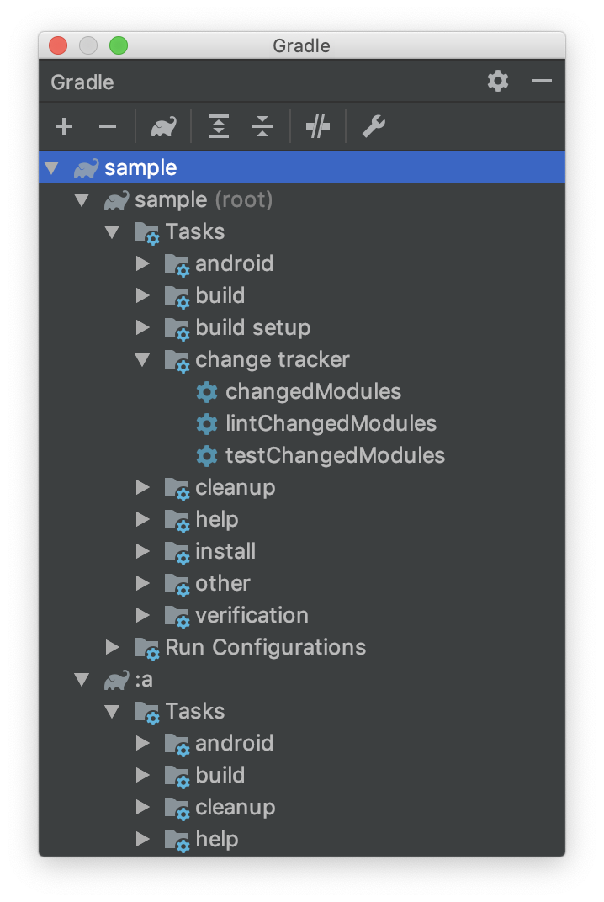

[  ](https://plugins.gradle.org/plugin/com.ismaeldivita.changetracker)

# Change Tracker Plugin
A Gradle plugin to discover the dependency graph between the modules and run specific tasks only on changed modules and his dependents.

When we're working on a modular Android project, we don't need to run our verification tasks on all modules every time you open a pull request, we can only run on the modules affected by the changes and all his dependents, with this approach we can save a lot of time on the CI giving faster feedback about the changes to the developers.
___



To exemplify, take the following project structure as an example:

If you apply changes to the `:profile-service` module, you only need to run your verification tasks on `:profile-service`, `:profile`, and `:app`. It's safe to skip the verification tasks on all the other modules because they don't depend on `:profile`, and can't be affected by these changes.

<br clear="right"/>

## Installation

Apply the plugin to your root project `build.gradle` and add the configuration block.

```groovy 
plugins {
    id 'com.ismaeldivita.changetracker' version '0.4.0'
}

...

changeTracker {
    tasks = ['lint','testDebugUnitTest']
    whitelist = [':app']
    blacklist = [':network',':featureA']
    reevaluate = [':sharedTestModule']
    branch = "master"
}
```
- `tasks`: List of tasks the plugin will need to create. 
- `whitelist` (optional): List of modules that should **always** run.
- `blacklist` (optional): List of modules that should **never** run.
- `reevaluate` (optional): List of modules that will trigger the task for all modules
- `branch`: Name of the branch that should compare to the current one to extract the diff.

## Usage


The plugin will generate new tasks on the root project for each task provided on the configuration with the following pattern `${taskName}ChangedModules`.

These generated tasks will run the `changedModules` task to get the list of changed modules and for each one will call the given task.

Taking as an example the configuration above the plugin will generate two new tasks `lintChangedModules` and `testDebugUnitTestChangedModules`.

To run your task:

```
./gradlew testDebugUnitTestChangedModules
```

You can override the default branch used for the comparison when running your command. This is useful when you're using the plugin on pull requests and each pull request may have different base branches.
```
./gradlew testChangedModules -Pbranch=dev
```


<br clear="right"/>

> **Notes**
>- This plugin assumes you use GIT as your VCS.
>- Any changes to the root project or `buildSrc` will trigger the task for all modules.


## License
MIT License

Copyright (c) 2019 Ismael Di Vita

Permission is hereby granted, free of charge, to any person obtaining a copy
of this software and associated documentation files (the "Software"), to deal
in the Software without restriction, including without limitation the rights
to use, copy, modify, merge, publish, distribute, sublicense, and/or sell
copies of the Software, and to permit persons to whom the Software is
furnished to do so, subject to the following conditions:

The above copyright notice and this permission notice shall be included in all
copies or substantial portions of the Software.

THE SOFTWARE IS PROVIDED "AS IS", WITHOUT WARRANTY OF ANY KIND, EXPRESS OR
IMPLIED, INCLUDING BUT NOT LIMITED TO THE WARRANTIES OF MERCHANTABILITY,
FITNESS FOR A PARTICULAR PURPOSE AND NONINFRINGEMENT. IN NO EVENT SHALL THE
AUTHORS OR COPYRIGHT HOLDERS BE LIABLE FOR ANY CLAIM, DAMAGES OR OTHER
LIABILITY, WHETHER IN AN ACTION OF CONTRACT, TORT OR OTHERWISE, ARISING FROM,
OUT OF OR IN CONNECTION WITH THE SOFTWARE OR THE USE OR OTHER DEALINGS IN THE
SOFTWARE.
